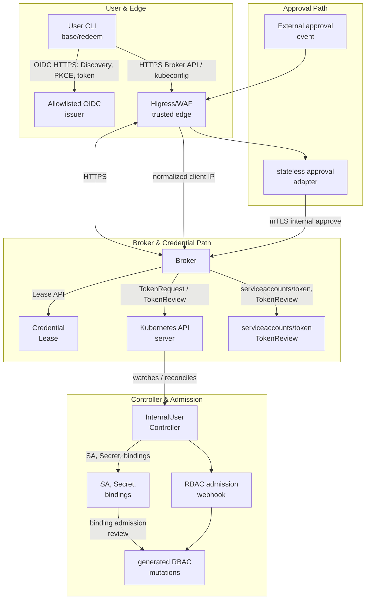

# Internal User Credentials Architecture

Status: implementation architecture for the InternalUser credential system.
This document describes the code and deployment shape in this repository. It
is the architectural companion to
[`internal-user-credentials-design.md`](internal-user-credentials-design.md),
not a production approval. The acceptance matrix, execution status, and
remaining work are recorded in
[`internal-user-credentials-acceptance.md`](internal-user-credentials-acceptance.md),
[`internal-user-credentials-acceptance-status.md`](internal-user-credentials-acceptance-status.md),
and [`internal-user-credentials-todo.md`](internal-user-credentials-todo.md).

The Chinese companion is
[`internal-user-credentials-architecture.zh-CN.md`](internal-user-credentials-architecture.zh-CN.md).

## 1. Purpose and boundaries

The system provides short-lived Kubernetes credentials to individually
identified internal personnel. It separates identity administration,
ordinary credential issuance, elevated approval, Kubernetes resource
preparation, and token issuance into components with different permissions.

The architecture has these goals:

- represent one real person with one immutable OIDC issuer/subject pair;
- issue a daily base credential through the person's own OIDC login;
- issue elevated credentials only after an external approval has completed;
- make elevated access temporary and lease-specific;
- keep tokens and kubeconfig data out of Kubernetes resources, controller
  state, approval records, and logs;
- fail closed when identity, approval, network, admission, or persistence
  dependencies are unavailable;
- make retries, restarts, response loss, and cleanup races converge safely.

The following are deliberately outside this version:

- automatic personnel-directory synchronization;
- a user-facing elevated request endpoint;
- a portal or long-lived refresh-token store;
- arbitrary caller-supplied RBAC rules or ClusterRoles;
- direct ordinary-user access to `CredentialLease` objects;
- a client-certificate credential path for normal users.

The administrator workflow is the source of truth for `InternalUser` lifecycle
state. The administrator CLI creates identities through the Kubernetes API.
The approval adapter, or the approved manual administrator operation,
submits completed elevated approvals to the Broker. Neither path lets a
regular user approve or create a lease directly.

## 2. Architecture at a glance

The system has a control plane, which stores identity and lease state, and a
credential data path, which performs one irreversible TokenRequest and returns
one kubeconfig.



The CLI-to-OIDC arrow is direct. Higress/WAF does not proxy OIDC discovery or
token exchange; its external application route terminates at the Broker. The
adapter uses the external approval system and SMTP independently, and reaches the Broker only through
the dedicated mTLS internal-approval route.

The two credential workflows are:

```text
Base:
  user CLI -> OIDC login -> Broker -> base CredentialLease
  -> Controller prepares stable ServiceAccount + empty bound Secret
  -> Broker marks lease consumed -> TokenRequest + TokenReview
  -> kubeconfig response -> CLI writes mode 0600

Elevated:
  External approval -> adapter fetches authoritative instance
  -> Broker mTLS internal approve -> Broker persists AwaitingRedemption Lease
  -> adapter sends reference to target user
  -> user CLI fresh OIDC login + reference -> Broker
  -> Controller prepares temporary ServiceAccount + binding + empty Secret
  -> Broker marks lease consumed -> TokenRequest + TokenReview
  -> kubeconfig response -> CLI writes mode 0600
```

## 3. Components and trust boundaries

| Component | Primary responsibility | Trusted inputs | Explicitly cannot do |
| --- | --- | --- | --- |
| OIDC issuer | Authenticate people and publish claims/JWKS | Issuer URL and signing keys from server configuration | Decide Kubernetes RBAC or create a lease |
| `internal-user-cli` | Perform OIDC Authorization Code + PKCE and receive a kubeconfig | Fresh browser login and server TLS certificate | Select a target, select RBAC rules, or print/store tokens outside the selected file |
| Higress/WAF | Public edge, source-IP derivation, rate and body limits | Configured trusted proxy chain | Treat a client-supplied forwarding header as authoritative |
| Broker | Authenticate API calls, enforce profile policy, persist leases, issue tokens | Verified OIDC claims, mTLS client certificate, Kubernetes API state | Create identities, read Secret data, write arbitrary RBAC, or trust approval text by itself |
| InternalUser Controller | Reconcile stable and temporary non-secret resources | `InternalUser`, `CredentialLease`, and reviewed profile ClusterRoles | Call TokenRequest, read token data, or manage the standard Sealos `User` resource |
| RBAC admission webhook | Constrain Controller-owned ClusterRoleBinding mutations | Live owner objects and Controller username | Grant permissions to users or replace Kubernetes RBAC generally |
| External approval system | Host the external approval workflow | Its own approval state and event delivery | Directly authorize a Kubernetes token |
| Approval adapter | Verify event, fetch approved instance, call Broker, notify target | Fixed Approval definition code/fields, verification token, mTLS Broker identity | Persist event state, access Kubernetes, issue a token, or return a kubeconfig |
| Administrator CLI | Create/suspend/resume/delete `InternalUser`; manual approval fallback | Administrator kubeconfig or dedicated mTLS client certificate | Read Secrets, call TokenRequest, or write arbitrary RBAC |
| Kubernetes API server | Durable object state, RBAC, TokenRequest and TokenReview | Kubernetes authentication and authorization | Infer human approval from a message or email |

The important trust boundaries are:

1. **Human identity boundary.** A valid OIDC token is required for normal
   Broker credential operations. An allowed source IP or an approval reference
   is not an identity credential.
2. **Edge boundary.** Higress is trusted to derive the client address only
   through its configured proxy chain. It must remove client-supplied
   `Forwarded`, `X-Forwarded-For`, `X-Real-IP`, and trusted-IP headers.
3. **Broker boundary.** The Broker is the only user-facing lease state
   boundary. Its Kubernetes ServiceAccount is intentionally unable to create
   identities or arbitrary RBAC.
4. **Controller boundary.** The Controller has a necessary exception to write
   platform-generated ClusterRoleBindings. The independent admission webhook
   limits that exception to expected names, role references, subjects, labels,
   owners, and lifecycle state.
5. **Approval boundary.** External approval is authoritative only after the
   adapter retrieves the complete approved instance and submits it over mTLS.
   The resulting reference is an audit and lookup value, not a second login.

## 4. Namespaces and resource ownership

| Location | Resources | Owner or writer | Exposure |
| --- | --- | --- | --- |
| Cluster scope | `InternalUser` and its status/finalizer | Administrator workflow creates; Controller reconciles | No ordinary user direct mutation |
| `internal-user-system` | Stable and temporary ServiceAccounts; empty bound Secrets | Controller | Not reachable by ordinary application Pods |
| `internal-credential-broker` | `CredentialLease` and status/finalizer | Broker creates lease/spec and status; Controller reconciles status/resources | Internal persistence only; no direct user RBAC |
| `internal-user-controller` | Controller, CRD webhook, RBAC admission webhook, certificates | Platform deployment | Internal cluster service |
| `internal-credential-approval` | Stateless approval adapter and its certificates | Platform deployment | External approval callback through the configured edge |

`InternalUser` is cluster-scoped because the identity and stable account are
cluster-wide. `CredentialLease` is namespaced but is valid only in
`internal-credential-broker`; its webhook defaults and validates this
namespace. A lease never contains a token, kubeconfig, private key, or Secret
data.

The owner model is label-based and deterministic. Every Controller-owned
ServiceAccount, Secret, and ClusterRoleBinding carries the relevant controller,
InternalUser, lease, and owner UID labels. Before adoption, update, or delete,
the Controller verifies these labels. A mismatch is fail closed: the object is
not adopted or removed, the lease finalizer remains, and an actionable warning
is emitted.

Ordinary users and administrators do not use Kubernetes API verbs on
`credentialleases.user.sealos.io`. The required external RBAC policy denies
get/list/watch/create/update/patch/delete for those identities. The Broker
derives the requester from the verified OIDC claims, and the Controller sees
only Broker-created state.

## 5. Identity and `InternalUser` lifecycle

An `InternalUser` contains only:

```yaml
spec:
  identity:
    issuer: https://login.example.internal
    subject: opaque-immutable-subject
  roleProfile: base-readonly.v1
  suspend: false
```

The issuer must be HTTPS and in the server-side allowlist. The subject is
opaque, non-empty, and immutable. The caller cannot provide a display name as
the identity. The object name is derived as:

```text
iu-<first-24-hex-digits-of-sha256(issuer + NUL + subject)>
```

This makes duplicate creation deterministic and prevents changing an object
name to take over another identity. The derived name is also the stable
ServiceAccount name and is exposed in status.

The lifecycle is:

```text
Pending -> Active
   |         |
   |         +--> Suspended
   |         |         |
   +---------+---------+
             |
             +--> Failed (reconciliation error)

Active or Suspended -- administrator deletion --> finalizer cleanup -> deleted
```

For an active user, the Controller ensures one stable ServiceAccount in
`internal-user-system`, with `automountServiceAccountToken: false`, and one
base `ClusterRoleBinding`. It does not create a namespace or the existing
standard Sealos `User` resource.

Setting `spec.suspend: true` causes the Controller to remove the base binding,
revoke all active leases for the identity, and clean their owned resources.
The `InternalUser` and stable ServiceAccount remain so that an administrator
can deliberately resume the identity. Deletion is permanent after finalizer
cleanup: active leases are revoked, base and temporary bindings are removed,
owned Secrets and temporary ServiceAccounts are deleted, and the stable
ServiceAccount is deleted before the `InternalUser` finalizer is removed.

There is no automatic personnel-directory sync component in version one.
Adding or removing personnel is an administrator-controlled operation and is
not a Broker availability dependency.

## 6. Profiles and permission attachment

Profiles are server-owned, versioned policy names. The caller can select a
known profile where the API permits it, but cannot provide a ClusterRole name,
rules, subjects, or an arbitrary TTL.

| Profile | Account used | Maximum TTL | Approval | Current role attachment |
| --- | --- | ---: | --- | --- |
| `base-readonly.v1` | Stable `InternalUser` ServiceAccount | 24 hours | No external approval | `internal-user-base-readonly-v1` |
| `cluster-ops-write.v1` | Lease-specific temporary ServiceAccount | 1 hour | Completed external approval required | `internal-user-cluster-ops-write-v1` |

All requested TTLs must be at least 10 minutes. The API server's actual
TokenRequest expiration is authoritative and can be shorter.

The current profile manifests define `base-readonly.v1` as `get/list/watch`
for Pods, Services, Deployments, and ReplicaSets. The current
`cluster-ops-write.v1` manifest has the same read access plus `create/patch`
for Events. The profile name is a policy version, not a promise of arbitrary
write access. Any future workload write permission must be reviewed for
ServiceAccount selection and workload-based privilege escalation, then added
as a new reviewed profile version.

The elevated profile is never attached to the stable ServiceAccount. A
successful elevated lease gets one temporary ServiceAccount and one temporary
ClusterRoleBinding. This makes elevated authorization independently revocable
and guarantees that a base credential cannot become elevated through a later
reconciliation.

## 7. `CredentialLease` state machine

The durable lease record uses these phases:

```text
                         +------------------+
                         | AwaitingRedemption|
                         +---------+--------+
                                   |
                                   | user OIDC + reference
                                   v
Pending -----------------------> Prepared -----------------> Issued
  |                                |                           |
  |                                |                           +--> Expired
  +------------------------------>+--------------------------> Revoked
```

More precisely:

- `AwaitingRedemption -> Pending` when a target user successfully redeems an
  approved reference;
- `Pending -> Prepared` after the Controller has prepared all non-secret
  objects;
- `Prepared -> Issued` after Broker CAS-consumes the lease, completes
  TokenRequest and TokenReview, validates the result, and records expiration;
- `Pending` or `Prepared -> Failed` for invalid or unrecoverable input;
- `Pending` or `Prepared -> Revoked` when the target is suspended or an
  authorized revocation occurs;
- `Issued -> Expired` at actual token expiration, or `Issued -> Revoked` on
  revocation;
- `Failed`, `Revoked`, and `Expired` are terminal and never become issuable.

The status contains only object references, conditions, timestamps, and
non-secret lifecycle data:

- stable or temporary ServiceAccount reference;
- empty bound Secret reference;
- temporary binding reference when elevated;
- approval expiration and redemption timestamps;
- `ConsumedAt` and actual token expiration timestamp.

The Controller uses a periodic scan in addition to watches. This recovers from
missed events, process restarts, and status-update races. Terminal cleanup
removes resources in this order:

1. remove the ClusterRoleBinding;
2. delete the empty bound Secret;
3. delete the temporary ServiceAccount;
4. remove the lease finalizer after all owned objects are gone.

For a base lease, the stable ServiceAccount is referenced and no temporary
binding is created. For an elevated lease, all three temporary resources are
lease-specific. The empty Opaque Secret is used as the TokenRequest bound
object; its deletion invalidates the associated bound token according to
Kubernetes token semantics. The Secret must remain data-free.

## 8. Broker API and authorization

The Broker is the only user-facing credential service. All non-health external
requests require an allowed source path and a verified OIDC bearer token.

| Endpoint | Authentication | Behavior |
| --- | --- | --- |
| `GET /healthz` | None | Liveness only; excluded from credential audit and rate limiting |
| `POST /v1/credentials/base` | OIDC | Issues only the caller's own `base-readonly.v1` credential. Request body contains only requested TTL |
| `POST /v1/credentials/elevated/redeem` | OIDC | Accepts only a reference; target, requester, profile, TTL, and approval come from the persisted lease |
| `GET /v1/credentials/{leaseID}` | OIDC | Returns non-secret status to the lease requester or configured administrator group |
| `POST /v1/credentials/{leaseID}/revoke` | OIDC | Allows the requester to revoke its own lease, or an administrator-group principal to revoke an authorized lease |
| `POST /v1/internal/credentials/approve` | Dedicated mTLS | Accepts a completed external approval record and creates or returns the persisted reference |

The old administrative OIDC issuance endpoint is not part of this contract.
The administrator CLI creates `InternalUser` directly with its administrator
kubeconfig and uses the same mTLS internal-approve capability for the manual
break-glass approval path. It does not use the ordinary user endpoint to
create an elevated lease.

The Broker rejects unknown JSON fields and limits request body size. It never
accepts caller-selected OIDC issuer, Kubernetes audience, target identity for
the ordinary endpoint, profile rules, or ClusterRole names.

## 9. External approval and elevated issuance

The external approval system owns the human approval interaction. The external approval system is
the initial integration, but the Broker interface is intentionally expressed
as a non-secret approval record so another adapter can be added later.

The Approval form contains the immutable subject, requested TTL, and a human
reason. The adapter deployment fixes the accepted approval definition, target
issuer, and form field names. A callback payload is not authoritative by
itself.

### 9.1 Approval sequence

```text
1. External approval system creates and processes an approval instance.
2. External approval system sends an APPROVED event to the adapter.
3. Adapter verifies the callback token and optional signed callback headers.
4. Adapter fetches the full instance from the external system and verifies:
   - instance code matches the event;
   - approval definition is the configured one;
   - authoritative status is APPROVED;
   - fixed-issuer subject, TTL, and reason fields satisfy policy;
   - the initiator resolves to a valid notification email.
5. Adapter calls Broker POST /v1/internal/credentials/approve over mTLS.
6. Broker verifies the client certificate, target is active, profile is
   cluster-ops-write.v1, and TTL is within policy.
7. Broker persists one CredentialLease in AwaitingRedemption and generates a
   random one-time reference tied to the approval lease name.
8. Adapter sends only the reference and non-secret approval metadata to the
   target through the configured protected notification channel.
9. Target CLI performs a fresh OIDC login and sends only the reference to
   /v1/credentials/elevated/redeem.
10. Broker checks that authenticated issuer/subject equals both persisted
    requester and target, checks reference expiry and phase, and updates the
    lease to Pending with a status compare-and-swap.
11. Controller prepares the temporary ServiceAccount, ClusterRoleBinding, and
    empty bound Secret. Broker waits for Prepared.
12. Broker marks ConsumedAt before the irreversible TokenRequest, requests a
    fixed Kubernetes audience, validates with TokenReview, records actual
    expiration, and returns one kubeconfig.
```

The reference is not an authentication factor. Possession of a reference
without a fresh OIDC login by the approved target is insufficient. A message
URL or text note cannot authorize a redemption.

### 9.2 Stateless adapter and Broker persistence

The adapter does not persist event-consumption state. It may be restarted or
receive the same external approval event repeatedly. The Broker uses the external
`approvalID` as an idempotency key:

- the deterministic lease name is derived from `sha256(approvalID)`;
- the first accepted record creates the lease and a random reference;
- a repeat with identical target, TTL, and reason returns the same approval
  response;
- a repeat with changed fields returns a conflict;
- if notification fails after Broker success, retrying the callback obtains
  the same reference and can retry delivery;
- a new approval ID is required for a new reference.

The persisted lease is the source of truth for target, requester, profile,
requested TTL, approval ID, approval reference, approval reason, approval
expiry, redemption, consumption, and issuance state. No separate adapter
database is required for correctness. The approval reference is sensitive
workflow metadata and must be protected by Kubernetes API RBAC and log
redaction even though it is not a Kubernetes bearer token.

## 10. Token issuance and sensitive-data boundary

The Controller prepares resources but never calls TokenRequest and never reads
Secret data. The Broker performs the irreversible issuance:

1. verify the target `InternalUser` is active and the lease is prepared;
2. validate every status reference and expected lease-owned name;
3. update `ConsumedAt` with a resourceVersion compare-and-swap;
4. call `serviceaccounts/token` with a server-fixed Kubernetes audience and
   the empty Secret as a bound object;
5. validate the returned token through TokenReview and verify its audience;
6. use `TokenRequest.status.expirationTimestamp` as the source of truth;
7. record `Issued` and actual expiration;
8. build the kubeconfig in memory and return it exactly once.

If the TokenRequest succeeds but the response is lost, the lease remains
consumed. The Broker must never read a token from a Secret, retry the
TokenRequest for the same lease, or later re-deliver the lost kubeconfig. The
user starts a new issuance or approval workflow.

The Broker's own Kubernetes authentication uses a projected ServiceAccount
token with an explicit Kubernetes audience and a short lifetime. Its default
automount is disabled, and the deployment does not create a long-lived Broker
token Secret. The TokenRequest audience is independent from the OIDC Broker
audience and neither is caller-selectable.

The CLI writes the returned kubeconfig only to the explicitly selected local
regular-file path, refuses a symlink, and uses mode `0600`. It prints only
issuer, derived username, profile, lease ID, and expiration metadata. It does
not persist refresh tokens or approval references in its YAML configuration.

## 11. Authentication, authorization, and source IP

### 11.1 OIDC authentication

The CLI is a public OIDC client. It uses Authorization Code + PKCE with a
loopback callback, state, nonce, and S256 code verifier. The Broker validates
issuer, audience, signature, subject, `exp`, and `nbf` with configured
discovery/JWKS data and bounded clock skew.

The administrator group is an OIDC `groups` claim emitted by the configured
issuer. The Broker accepts the configured exact group value only after token
signature and issuer/audience verification. A group claim is not inferred from
an email, source IP, approval reference, or caller-supplied JSON. The
administrator CLI's identity-creation operation instead relies on Kubernetes
RBAC in the kubeconfig it loads; it is not granted create authority merely by
having an OIDC admin group.

### 11.2 Internal mTLS approval

The internal approval endpoint is disabled when
`internal-client-ca-file` is empty. When enabled, the Broker validates a client
certificate chain against the dedicated CA and requires the ClientAuth
extended key usage. The adapter and manual break-glass administrator operation
use separately managed client keys/certificates. Client certificate issuance,
storage, rotation, and revocation are part of the platform trust boundary.

The endpoint is not an ordinary user endpoint. Its network path is restricted
by NetworkPolicy and service routing, and the client certificate must be
treated as authority to submit an already-approved record. The mTLS record
still undergoes Broker-side target, profile, issuer, TTL, and active-user
checks.

### 11.3 Defense-in-depth source IP checks

The intended external path is:

```text
client -> Higress/WAF -> Broker
```

Higress/WAF derives the real client IP from the explicitly configured trusted
proxy chain, removes client-controlled forwarding headers, applies its source
CIDR allowlist, and writes one normalized internal header, by default
`X-Trusted-Client-IP`.

The Broker then checks both:

1. the TCP peer address is in `trusted-proxy-cidrs`; and
2. exactly one normalized client-IP header is present and its address is in
   `allowed-client-cidrs`.

Missing, malformed, duplicated, or untrusted headers fail closed. Direct
Broker access is blocked by service exposure and NetworkPolicy, so a caller
cannot bypass the trusted peer check. IP allowlisting is defense in depth and
never replaces OIDC or mTLS authentication. The real Higress proxy-chain
derivation remains an additional integration gate in the acceptance plan.

## 12. RBAC and admission design

### 12.1 Broker permissions

The Broker ServiceAccount has only the permissions needed to execute its
protocol:

- get `InternalUser` objects by deterministic name;
- create `CredentialLease` objects in the Broker namespace;
- get and update/patch only `CredentialLease/status`;
- create `TokenReview` objects;
- create `serviceaccounts/token` in `internal-user-system` through a
  namespaced Role.

It cannot create or update `InternalUser`, read Secret data, list all users,
create bindings, select arbitrary ClusterRoles, or manage arbitrary RBAC.

### 12.2 Controller permissions and namespace-scoped cache

The Controller reconciles both cluster-scoped CRDs and selected generated
resources. Its ServiceAccount has cluster-scoped access to the CRDs,
ClusterRoleBindings, profile ClusterRoles, namespaces, and Events, but the
ServiceAccount and Secret permissions are granted only by a Role in
`internal-user-system`.

The controller manager configures `cache.ByObject` for ServiceAccounts and
Secrets with `internal-user-system` as the only namespace. This is required:
predicates do not reduce the RBAC scope needed to start a cluster-scoped
informer. The namespace-scoped cache keeps the controller from requiring
cluster-wide Secret list/watch permission.

The Controller never performs TokenRequest, so it cannot directly obtain the
credential it prepares.

### 12.3 ClusterRoleBinding admission

Kubernetes RBAC cannot express “allow this ServiceAccount to create only
ClusterRoleBindings with these names and labels.” The Controller therefore
has a deliberate dynamic ClusterRoleBinding write permission, protected by an
independent ValidatingAdmissionWebhook with `failurePolicy: Fail`.

The admission service is a separate Deployment, ServiceAccount, certificate,
and RBAC configuration. It validates only mutations from the exact Controller
ServiceAccount and checks:

- base versus elevated binding shape;
- expected profile ClusterRole;
- deterministic binding name;
- exactly one expected ServiceAccount subject and namespace;
- Controller, InternalUser, lease, and UID ownership labels;
- current owner existence, identity, suspension, deletion, and terminal state;
- operation-specific cleanup rules.

Unrelated callers are not authorized by this webhook. If its dependency lookups
fail or the webhook has no endpoint, `failurePolicy: Fail` prevents the
Controller's binding mutation. This admission control is a production
requirement for the Controller's privilege exception, not an optional test
component.

## 13. Deployment and network dependencies

The deployment is split into independently rendered Kustomize packages:

- `config/crd`: `InternalUser` and `CredentialLease` CRDs;
- `config/internal-user-controller`: Controller, CRD webhooks, profiles, and
  namespace-scoped resource Role;
- `config/internal-user-admission`: ClusterRoleBinding admission service;
- `config/broker`: Broker, projected token, source-IP policy, and lease/API
  RBAC;
- `config/internal-user-approval-adapter`: approval adapter, TLS, mTLS client
  materials, and notification configuration.

Installation prerequisites include:

- Kubernetes `serviceaccounts/token` and TokenReview support;
- an allowlisted HTTPS OIDC issuer with discovery and JWKS;
- cert-manager or an equivalent certificate provisioning process;
- a NetworkPolicy-capable CNI;
- Higress/WAF configured with a trusted proxy chain;
- External application credentials, callback verification configuration, and
  approval API access;
- an approved SMTP or equivalent protected notification channel;
- reviewed profile ClusterRoles and the RBAC admission webhook;
- protected centralized audit/log collection before production issuance.

The Broker, Controller, adapter, and `internal-user-system` use default-deny
NetworkPolicies. Broker ingress is limited to Higress and the adapter path;
adapter ingress is limited to the configured gateway. Broker egress is
limited to Kubernetes API, configured OIDC discovery/JWKS, and the protected
audit sink. Adapter egress is limited to the external approval system, the SMTP relay, and Broker.
Exact CIDRs and service labels are installation-specific and must replace the
example values in manifests.

The following deployment details are intentional:

- Broker client CA Secret: `internal-credential-broker-client-ca`;
- Broker CA file: `/etc/broker/internal-client-ca/ca.crt`;
- an empty Broker `internal-client-ca-file` leaves the internal approval
  endpoint disabled and returns `404`;
- adapter secrets: `internal-credential-approval-adapter-secrets`,
  `internal-credential-approval-adapter-broker-client`, and
  `internal-credential-approval-adapter-broker-ca`;
- adapter ServiceAccount token automount is disabled;
- Broker's projected Kubernetes token is audience-bound and expires after
  600 seconds.

## 14. Failure, retry, and recovery behavior

| Failure | Required behavior |
| --- | --- |
| OIDC discovery/JWKS unavailable | Reject new base issuance and redemption; do not use cached validation to fail open. Existing issued tokens run to their original expiration. |
| External approval API or callback validation unavailable | Adapter returns a retryable failure and does not call Broker with unverified data. No adapter event database is needed. |
| Broker unavailable after External approval | The external approval system retries the event; Broker `approvalID` idempotency prevents duplicate leases. |
| Notification fails after Broker success | Adapter retry receives the same reference. It must not create a new approval record. |
| Broker or Controller restarts | Lease and approval state remain in Kubernetes. Watches, periodic scanning, finalizers, and idempotent resource creation converge. |
| TokenRequest response is lost | `ConsumedAt` prevents another TokenRequest. The lost token is never recovered or re-delivered. |
| Status update fails after TokenRequest | Treat the lease as consumed and investigate; never retry issuance for that lease. |
| Target is suspended | New issuance/redeem is rejected; active leases are revoked and owned resources are cleaned. |
| Owned object labels or UID mismatch | Do not adopt, modify, or delete. Keep the finalizer and alert for manual resolution. |
| Admission webhook unavailable | Controller ClusterRoleBinding mutations fail closed. Restore the webhook before reconciliation can complete. |
| Audit sink unavailable | Broker withholds the response and returns a safe service-unavailable result; it does not deliver a one-time credential without an accepted audit event. |
| Source header missing or forged | Broker rejects the request even when a token is otherwise valid. |

Revocation and cleanup must remain available when OIDC or External approval system is down; they
must not depend on a new approval or fresh identity lookup when the persisted
lease and owner state are sufficient.

## 15. Observability, audit, and data handling

Health and readiness probes expose only process health. Broker audit events
contain operation, requester, target, profile, lease ID, approval reference,
source IP, user-agent, result, status code, and timestamp. They must never
contain a token, kubeconfig, refresh token, private key, or Secret data.

Controller warning Events should identify lease or owner metadata and the
failure reason, but not credential material. Operational alerts should cover
repeated Broker 4xx/5xx responses, OIDC validation failures, approval
submission failures, preparation timeout, finalizer retention, owner mismatch,
admission rejection, and source-IP rejection spikes.

Audit and information-disclosure verification are separate production gates in
the acceptance plan. The default functional acceptance run intentionally does
not score centralized audit completeness or broad information-disclosure
searches, but the deployment still requires a protected audit sink before
production credentials are issued.

The approval reference is stored in the lease and included in the approval
audit event because it is needed for traceability. Access to it must be
restricted; it is not safe to put it in public tickets or general logs.

## 16. Security properties and residual risks

The design provides these concrete properties:

- user-supplied targets cannot redirect ordinary issuance;
- profile and audience selection are server-owned;
- elevated permissions cannot be attached to the stable account;
- `CredentialLease` is not a user-writable Kubernetes API;
- a lease can cause at most one irreversible TokenRequest;
- the API server's actual expiration drives cleanup;
- a Secret read cannot recover a token because the bound Secret is empty;
- a copied kubeconfig remains a bearer credential until expiration or
  revocation, so file protection and short TTLs matter;
- Controller binding creation is constrained by independent admission;
- source-IP checks provide defense in depth at both edge and Broker.

The remaining risks require operational controls:

- compromise of the administrator kubeconfig or mTLS client certificate can
  create identities or submit approvals; these credentials need separate
  issuance, storage, rotation, and revocation controls;
- compromise of the Controller is high impact because it has dynamic binding
  write permission; the admission webhook and profile review are mandatory;
- any future workload write rule must be evaluated for ServiceAccount and
  workload privilege escalation;
- a user can copy an issued kubeconfig; OIDC login and approval history do not
  prove who later holds the file;
- IP allowlists can restrict network origin but cannot authenticate a person;
- External approval system and email delivery can expose the reference if the configured
  channels are not protected; a reference still cannot redeem without OIDC,
  but it should be treated as sensitive workflow data;
- certificate, OIDC, WAF, NetworkPolicy, audit retention, and administrator
  group configuration are deployment responsibilities, not encoded solely in
  application code.

## 17. Rollout and acceptance relationship

Rollout should proceed in this order:

1. review and apply CRDs, namespaces, profile ClusterRoles, and external RBAC;
2. provision certificates, OIDC configuration, Broker client CA, and network
   policies;
3. deploy and verify the RBAC admission webhook before enabling the
   Controller's binding writes;
4. deploy the Controller and verify namespace-scoped caches and reconciliation;
5. deploy Broker and verify OIDC, Kubernetes TokenRequest/TokenReview,
   source-IP, and audit behavior;
6. deploy the adapter only after external approval and notification credentials are
   configured;
7. run the acceptance matrix, then explicitly review residual risk before
   enabling an external route or production credentials.

The default acceptance run excludes real Higress/WAF proxy-chain integration
and centralized audit/information-disclosure testing. Those remain additional
release gates, as documented in the acceptance plan. Live external approval system delivery,
reference notification, and end-to-end elevated redemption also require
environment-specific evidence.

## 18. Implementation map

The main implementation locations are:

- API types and CRD webhooks: `controllers/user/api/v1/`;
- identity and profile policy: `controllers/user/pkg/internalcredentials/`;
- Broker HTTP, OIDC, IP, audit, Kubernetes token, and kubeconfig logic:
  `controllers/user/pkg/broker/`;
- InternalUser and CredentialLease reconciliation:
  `controllers/user/controllers/internal_user_controller.go` and
  `controllers/user/controllers/credential_lease_controller.go`;
- ClusterRoleBinding admission validation:
  `controllers/user/pkg/rbacadmission/`;
- approval adapter, Broker mTLS client, and notification:
  `controllers/user/pkg/approvaladapter/`;
- person and administrator CLIs: `controllers/user/cmd/internal-user-cli/`
  and `controllers/user/cmd/internal-user-admin/`;
- component deployment packages: `controllers/user/config/`.

Operational command examples and configuration-file contracts are documented
in [`internal-user-credentials-cli.md`](internal-user-credentials-cli.md),
[`internal-user-admin-cli.md`](internal-user-admin-cli.md), and
[`internal-user-approval-adapter.md`](internal-user-approval-adapter.md).
