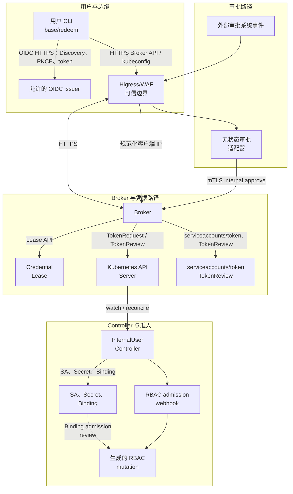

# Internal User 凭证系统架构

状态：InternalUser 凭证系统的实现架构文档。本文件描述当前仓库中的代码
和部署形态，是
[`internal-user-credentials-design.md`](internal-user-credentials-design.md)
的架构配套文档，不代表生产批准。验收矩阵、执行状态和剩余工作分别记录在
[`internal-user-credentials-acceptance.md`](internal-user-credentials-acceptance.md)、
[`internal-user-credentials-acceptance-status.md`](internal-user-credentials-acceptance-status.md)
和 [`internal-user-credentials-todo.md`](internal-user-credentials-todo.md)。

英文主文档为
[`internal-user-credentials-architecture.md`](internal-user-credentials-architecture.md)。

## 1. 目的与边界

系统为有明确身份的内部人员提供短期 Kubernetes 凭据。它将人员身份管理、
普通凭据签发、高权限审批、Kubernetes 资源准备和 TokenRequest 拆分到不同
权限的组件中。

架构目标：

- 一个真实人员对应一个不可变的 OIDC issuer/subject 身份对；
- 人员通过自己的 OIDC 登录获取日常 base 凭据；
- 高权限凭据只有在外部审批完成后才能签发；
- 高权限访问是临时的，并且绑定到单个 lease；
- Token 和 kubeconfig 不进入 Kubernetes 资源、Controller 状态、审批记录
  或日志；
- 身份、审批、网络、admission 或持久化依赖不可用时全部拒绝；
- 在重试、重启、响应丢失和清理竞争发生时仍能安全收敛。

本版本明确不包含：

- 自动人员目录同步；
- 面向普通用户的高权限申请接口；
- portal 或长期 refresh token 存储；
- 调用方自定义 RBAC 规则或 ClusterRole；
- 普通用户直接访问 `CredentialLease` 对象；
- 普通用户使用客户端证书获取凭据。

管理员流程是 `InternalUser` 生命周期状态的事实来源。管理员 CLI 通过
Kubernetes API 创建身份。审批适配器，或已批准的管理员手动操作，向
Broker 提交已完成的高权限审批。普通用户不能通过这些路径直接批准或创建
lease。

## 2. 总体架构

系统分为保存身份和 lease 状态的控制面，以及执行一次不可逆
TokenRequest 并返回一次 kubeconfig 的凭据数据路径。



CLI 到 OIDC issuer 是直接链路。Higress/WAF 不代理 OIDC discovery 或 token
交换；它的外部应用路由终止在 Broker。适配器独立访问外部审批系统和 SMTP，并且只通过
专用 mTLS internal-approve 链路访问 Broker。

两条凭据流程如下：

```text
Base：
  用户 CLI -> OIDC 登录 -> Broker -> base CredentialLease
  -> Controller 准备稳定 ServiceAccount + 空 bound Secret
  -> Broker 标记 lease consumed -> TokenRequest + TokenReview
  -> kubeconfig 响应 -> CLI 以 0600 权限写入

Elevated：
  外部审批系统 -> 适配器读取权威审批实例
  -> Broker mTLS internal approve -> Broker 持久化 AwaitingRedemption Lease
  -> 适配器将 reference 发送给目标用户
  -> 用户 CLI 新 OIDC 登录 + reference -> Broker
  -> Controller 准备临时 ServiceAccount + Binding + 空 bound Secret
  -> Broker 标记 lease consumed -> TokenRequest + TokenReview
  -> kubeconfig 响应 -> CLI 以 0600 权限写入
```

## 3. 组件职责与信任边界

| 组件 | 主要职责 | 可信任输入 | 明确不能做的事情 |
| --- | --- | --- | --- |
| OIDC issuer | 认证人员并发布 claims/JWKS | 服务端配置的 issuer URL 和签名密钥 | 决定 Kubernetes RBAC 或创建 lease |
| `internal-user-cli` | 执行 OIDC Authorization Code + PKCE 并接收 kubeconfig | 新鲜的浏览器登录和服务端证书 | 选择 target、RBAC 规则，或在指定文件之外打印/保存 token |
| Higress/WAF | 公网边界、源 IP 推导、速率和请求体限制 | 配置好的可信代理链 | 将客户端提供的转发头作为权威来源 |
| Broker | 认证 API、执行 profile 策略、持久化 lease、签发 token | 已验证 OIDC claims、mTLS 客户端证书、Kubernetes API 状态 | 创建身份、读取 Secret 数据、写任意 RBAC，或单凭审批文本信任 |
| InternalUser Controller | 协调稳定和临时的非敏感资源 | `InternalUser`、`CredentialLease` 和已审核 Profile ClusterRole | 调用 TokenRequest、读取 token 数据或管理 Sealos 标准 `User` |
| RBAC admission webhook | 约束 Controller 创建的 ClusterRoleBinding | owner 对象和 Controller 用户名 | 向用户授权或替代整个 Kubernetes RBAC |
| 外部审批系统 | 承载外部审批流程 | 自身审批状态和事件投递 | 直接授权 Kubernetes token |
| 审批适配器 | 验证事件、读取已批准实例、调用 Broker、通知目标 | 固定的审批 code/字段、验证 token、Broker mTLS 身份 | 持久化事件状态、访问 Kubernetes、签发 token 或返回 kubeconfig |
| 管理员 CLI | 创建/暂停/恢复/删除 `InternalUser`，提供手动审批兜底 | 管理员 kubeconfig 或专用 mTLS 客户端证书 | 读取 Secret、调用 TokenRequest 或写任意 RBAC |
| Kubernetes API Server | 持久化对象、RBAC、TokenRequest 和 TokenReview | Kubernetes 认证和授权 | 从消息或邮件推断人工审批 |

关键边界如下：

1. **人员身份边界。** 普通 Broker 凭据操作必须使用有效 OIDC token。允许
   的源 IP 或 approval reference 都不是身份凭据。
2. **边缘边界。** 只有通过配置的代理链推导出的地址才可以被信任。Higress
   必须移除客户端提交的 `Forwarded`、`X-Forwarded-For`、`X-Real-IP` 和
   trusted-IP 头。
3. **Broker 边界。** Broker 是唯一的用户侧 lease 状态边界。它的
   Kubernetes ServiceAccount 不能创建身份或写任意 RBAC。
4. **Controller 边界。** Controller 必须拥有写平台生成的
   ClusterRoleBinding 的例外权限。独立 admission webhook 将这个例外限制
   在预期的名称、roleRef、subject、label、owner 和生命周期状态内。
5. **审批边界。** 外部审批系统只有在适配器拉取完整的已批准实例并通过 mTLS
   提交后才具有授权意义。生成的 reference 是审计和查询值，不是第二次登录。

## 4. Namespace 与资源归属

| 位置 | 资源 | owner 或写入者 | 暴露范围 |
| --- | --- | --- | --- |
| Cluster scope | `InternalUser` 及 status/finalizer | 管理员流程创建，Controller 协调 | 普通用户不能直接修改 |
| `internal-user-system` | 稳定和临时 ServiceAccount，空 bound Secret | Controller | 普通应用 Pod 不可访问 |
| `internal-credential-broker` | `CredentialLease` 及 status/finalizer | Broker 创建 lease/spec 和 status，Controller 协调 status/资源 | 仅内部持久化，普通用户无直接 RBAC |
| `internal-user-controller` | Controller、CRD webhook、RBAC admission webhook、证书 | 平台部署 | 集群内部服务 |
| `internal-credential-approval` | 无状态审批适配器及证书 | 平台部署 | 通过配置的边缘接收外部审批系统回调 |

`InternalUser` 是 cluster-scoped，因为身份和稳定账号是集群范围的。
`CredentialLease` 虽然是 namespaced，但只允许位于
`internal-credential-broker`；它的 webhook 会默认并校验该 namespace。
lease 永远不包含 token、kubeconfig、私钥或 Secret 数据。

Controller 管理的 ServiceAccount、Secret 和 ClusterRoleBinding 使用确定性
名称和 label。每次 adopt、update 或 delete 前，Controller 都校验 controller、
InternalUser、lease 和 owner UID label。任何不匹配都 fail closed：不接管、
不修改、不删除对象，保留 lease finalizer，并产生可处理的 warning。

普通用户和管理员都不通过 Kubernetes API verb 操作
`credentialleases.user.sealos.io`。部署时的外部 RBAC 策略应拒绝这些身份的
get/list/watch/create/update/patch/delete。Broker 从已验证的 OIDC claims 推导
requester，Controller 只处理 Broker 创建的状态。

## 5. 身份模型与 `InternalUser` 生命周期

`InternalUser` 只包含以下信息：

```yaml
spec:
  identity:
    issuer: https://login.example.internal
    subject: opaque-immutable-subject
  roleProfile: base-readonly.v1
  suspend: false
```

issuer 必须是 HTTPS，并且位于服务端 allowlist。subject 是非空、不可猜测
含义且不可变的值。调用者不能用显示名称代替身份。对象名称按以下规则推导：

```text
iu-<sha256(issuer + NUL + subject) 的前 24 个十六进制字符>
```

这样重复创建会得到确定结果，不能通过更换对象名接管另一个身份。推导名称
同时是稳定 ServiceAccount 名称，并写入 status。

生命周期如下：

```text
Pending -> Active
   |         |
   |         +--> Suspended
   |         |         |
   +---------+---------+
             |
             +--> Failed（协调错误）

Active 或 Suspended -- 管理员删除 --> finalizer 清理 -> deleted
```

对于 active 用户，Controller 确保在 `internal-user-system` 中存在一个稳定
ServiceAccount，设置 `automountServiceAccountToken: false`，并创建一个 base
`ClusterRoleBinding`。它不会创建 namespace，也不会创建现有 Sealos 标准
`User` 资源。

设置 `spec.suspend: true` 后，Controller 移除 base binding，撤销该身份的
所有活动 lease，并清理其资源。`InternalUser` 和稳定 ServiceAccount 保留，
便于管理员明确执行 resume。删除是永久操作：先撤销活动 lease，清理 base 和
临时 binding、Secret、临时 ServiceAccount，再删除稳定 ServiceAccount，最后
移除 `InternalUser` finalizer。

v1 没有自动人员目录同步组件。人员的添加和移除由管理员控制，不是 Broker
的可用性依赖。

## 6. Profile 与权限绑定

Profile 是服务端维护的版本化策略名称。调用者只能选择 API 允许的已知
profile，不能提供 ClusterRole 名称、规则、subject 或任意 TTL。

| Profile | 使用的账号 | 最大 TTL | 审批要求 | 当前绑定的 role |
| --- | --- | ---: | --- | --- |
| `base-readonly.v1` | `InternalUser` 的稳定 ServiceAccount | 24 小时 | 无外部审批 | `internal-user-base-readonly-v1` |
| `cluster-ops-write.v1` | lease 专属临时 ServiceAccount | 1 小时 | 必须有已完成的外部审批 | `internal-user-cluster-ops-write-v1` |

所有请求 TTL 至少为 10 分钟。API Server 返回的实际 TokenRequest 过期时间
才是最终约束，并且可能短于请求值。

当前 Profile manifest 将 `base-readonly.v1` 定义为对 Pods、Services、
Deployments 和 ReplicaSets 的 `get/list/watch`。当前
`cluster-ops-write.v1` 具有相同的读取权限，另有对 Events 的
`create/patch`。profile 名称本身不代表任意写权限。未来如果需要 workload
写权限，必须重新评估 ServiceAccount 选择和通过 workload 提权的风险，并以
新的经过审核的 profile 版本发布。

高权限 profile 绝不会绑定到稳定 ServiceAccount。成功的高权限 lease 获得
一个临时 ServiceAccount 和一个临时 ClusterRoleBinding，因此可以独立撤销，
并保证 base 凭据不会因为后续 reconcile 变成高权限。

## 7. `CredentialLease` 状态机

持久化 lease 使用以下状态：

```text
                         +-------------------+
                         | AwaitingRedemption |
                         +---------+---------+
                                   |
                                   | 用户 OIDC + reference
                                   v
Pending -----------------------> Prepared -----------------> Issued
  |                                |                           |
  |                                |                           +--> Expired
  +------------------------------>+--------------------------> Revoked
```

具体规则：

- `AwaitingRedemption -> Pending`：目标用户用 OIDC 和 reference 成功兑换；
- `Pending -> Prepared`：Controller 准备完所有非敏感资源；
- `Prepared -> Issued`：Broker 用 CAS 消费 lease，完成 TokenRequest 和
  TokenReview，校验结果并记录过期时间；
- `Pending` 或 `Prepared -> Failed`：输入无效或发生不可恢复错误；
- `Pending` 或 `Prepared -> Revoked`：目标被暂停或执行授权撤销；
- `Issued -> Expired`：到达 token 实际过期时间；也可执行
  `Issued -> Revoked`；
- `Failed`、`Revoked`、`Expired` 是终态，不能重新变为可签发状态。

status 只包含对象引用、condition、时间戳和非敏感生命周期数据：

- 稳定或临时 ServiceAccount 引用；
- 空 bound Secret 引用；
- elevated 时的临时 binding 引用；
- approval expiration 和 redemption 时间；
- `ConsumedAt` 和实际 token 过期时间。

Controller 除 watch 外还会周期性扫描，以处理漏事件、进程重启和 status
更新竞争。终态清理顺序是：

1. 删除 ClusterRoleBinding；
2. 删除空 bound Secret；
3. 删除临时 ServiceAccount；
4. 所有 owner 资源删除后移除 lease finalizer。

base lease 引用稳定 ServiceAccount，不创建临时 binding。elevated lease 的
三个临时资源都属于该 lease。空的 Opaque Secret 作为 TokenRequest 的 bound
object；按 Kubernetes token 语义删除它会使对应 bound token 失效。Secret
必须始终无数据。

## 8. Broker API 与授权

Broker 是唯一的用户侧凭据服务。除 health 之外的外部请求都需要经过允许的
网络路径，并携带已验证的 OIDC bearer token。

| Endpoint | 认证 | 行为 |
| --- | --- | --- |
| `GET /healthz` | 无 | 仅存活探针，不进入凭据审计和限流 |
| `POST /v1/credentials/base` | OIDC | 只签发调用者自己的 `base-readonly.v1`，body 只有请求 TTL |
| `POST /v1/credentials/elevated/redeem` | OIDC | 只接受 reference，target、requester、profile、TTL 和审批来自持久化 lease |
| `GET /v1/credentials/{leaseID}` | OIDC | 向 lease requester 或配置的管理员 group 返回非敏感状态 |
| `POST /v1/credentials/{leaseID}/revoke` | OIDC | requester 可撤销自己的 lease，管理员 group 可撤销授权 lease |
| `POST /v1/internal/credentials/approve` | 专用 mTLS | 接收完成的外部审批记录，创建或返回持久化 reference |

旧的管理员 OIDC 签发 endpoint 不属于当前协议。管理员 CLI 使用管理员
kubeconfig 直接创建 `InternalUser`，并使用同一个 mTLS internal-approve 能力
完成手动/破窗审批。它不会使用普通用户 endpoint 创建 elevated lease。

Broker 拒绝未知 JSON 字段并限制请求体大小；不会接受调用者选择的 OIDC
issuer、Kubernetes audience、普通 endpoint 的 target、profile 规则或
ClusterRole 名称。

## 9. 外部审批与高权限签发

外部审批系统负责人工审批交互。第一版接入外部审批系统，但 Broker 使用非敏感审批
记录接口，以便未来接入其他适配器。

审批表单包含不可变 subject、请求 TTL 和人工 reason。适配器部署配置固定
审批定义、target issuer 和表单字段名。回调 payload 本身不是权威数据。

### 9.1 审批时序

```text
1. 外部审批系统创建并处理审批实例。
2. 外部审批系统向适配器发送 APPROVED 事件。
3. 适配器校验 callback token 和可选的签名回调头。
4. 适配器从外部审批系统读取完整实例并校验：
   - instance code 与事件一致；
   - approval definition 是配置的定义；
   - 权威状态为 APPROVED；
   - 固定 issuer 下的 subject、TTL、reason 均满足策略；
   - initiator 能解析出有效通知邮箱。
5. 适配器通过 mTLS 调用 Broker 的
   POST /v1/internal/credentials/approve。
6. Broker 校验客户端证书、target active、profile 为
   cluster-ops-write.v1，且 TTL 在策略范围内。
7. Broker 在 AwaitingRedemption 状态持久化一个 CredentialLease，并生成
   一个绑定到 approval lease name 的随机一次性 reference。
8. 适配器只通过配置的受保护通知渠道向目标发送 reference 和非敏感审批信息。
9. 目标 CLI 新 OIDC 登录，并仅向 /v1/credentials/elevated/redeem 发送
   reference。
10. Broker 校验登录后的 issuer/subject 同时等于持久化的 requester 和
    target，检查 reference 过期和状态，并用 status CAS 将 lease 改为 Pending。
11. Controller 准备临时 ServiceAccount、ClusterRoleBinding 和空 bound Secret。
    Broker 等待 Prepared。
12. Broker 在不可逆 TokenRequest 之前写入 ConsumedAt，使用固定 Kubernetes
    audience 执行 TokenRequest，通过 TokenReview 校验，记录实际过期时间并
    返回一次 kubeconfig。
```

reference 不是认证因子。只有 reference、没有已批准 target 的新鲜 OIDC 登录
不能兑换。消息 URL 或文本说明都不能单独授权兑换。

### 9.2 无状态适配器与 Broker 持久化

适配器不保存事件消费状态，可以重启，也可能反复收到同一个审批事件。Broker
使用外部 `approvalID` 作为幂等键：

- lease 名称由 `sha256(approvalID)` 确定性推导；
- 第一次接受记录时创建 lease 并生成随机 reference；
- target、TTL、reason 完全相同的重试返回同一个审批响应；
- 字段变化的重试返回 conflict；
- Broker 已成功但通知失败时，回调重试会拿到同一个 reference，可以重试通知；
- 要创建新的 reference，必须使用新的 approval ID。

持久化 lease 是 target、requester、profile、请求 TTL、approval ID、approval
reference、approval reason、审批过期、兑换、消费和签发状态的事实来源。不
需要额外的适配器数据库来保证正确性。approval reference 虽不是 Kubernetes
bearer token，仍属于敏感流程元数据，必须通过 Kubernetes API RBAC 和日志
脱敏保护。

## 10. Token 签发与敏感数据边界

Controller 只准备资源，不调用 TokenRequest，也不读取 Secret 数据。不可逆
签发由 Broker 执行：

1. 确认目标 `InternalUser` active 且 lease 为 Prepared；
2. 校验 status 中所有引用以及预期的 lease-owned 名称；
3. 用 resourceVersion CAS 更新 `ConsumedAt`；
4. 使用服务端固定 Kubernetes audience，并以空 Secret 作为 bound object，
   调用 `serviceaccounts/token`；
5. 用 TokenReview 校验 token 及 audience；
6. 以 `TokenRequest.status.expirationTimestamp` 为事实来源；
7. 记录 Issued 和实际过期时间；
8. 在内存中构造 kubeconfig 并只返回一次。

如果 TokenRequest 已成功但响应丢失，lease 仍然是 consumed。Broker 绝不能
从 Secret 读取 token、对同一 lease 再次 TokenRequest，或在之后重新发送丢失的
kubeconfig。用户必须重新发起新的签发或审批流程。

Broker 自身访问 Kubernetes 使用带明确 audience 的短期 projected
ServiceAccount token。默认 automount 被关闭，部署不会创建长期 Broker token
Secret。TokenRequest audience 与 OIDC Broker audience 独立，且都不能由调用者
选择。

CLI 只把返回的 kubeconfig 写入明确选择的本地普通文件路径，拒绝 symlink，
并使用 `0600` 权限。它只显示 issuer、derived username、profile、lease ID 和
过期元数据，不持久化 refresh token，也不将 approval reference 写入 YAML
配置文件。

## 11. 认证、授权与源 IP

### 11.1 OIDC 认证

CLI 是 public OIDC client，使用带 loopback 回调的 Authorization Code + PKCE，
并校验 state、nonce 和 S256 code verifier。Broker 使用配置的 discovery/JWKS
和有界 clock skew 校验 issuer、audience、签名、subject、`exp` 和 `nbf`。

管理员 group 是配置 issuer 在 OIDC `groups` claim 中发布的值。Broker 只有在
完成 token 签名、issuer 和 audience 验证后，才接受配置的精确 group 值。它不会
从邮箱、源 IP、approval reference 或调用者 JSON 推断管理员身份。管理员 CLI
的身份创建操作依赖其加载的 kubeconfig 中的 Kubernetes RBAC；不会仅因为拥有
OIDC admin group 就获得创建权限。

### 11.2 内部 mTLS 审批

当 `internal-client-ca-file` 为空时，内部审批 endpoint 被关闭。启用后，Broker
使用专用 CA 验证客户端证书链，并要求 ClientAuth extended key usage。适配器和
管理员手动/破窗操作使用分别管理的客户端密钥和证书。证书签发、保管、轮换和
撤销都属于平台信任边界。

该 endpoint 不是普通用户 endpoint。它由 NetworkPolicy 和服务路由限制，客户端
证书代表提交已审批记录的权限，必须严格保护。记录进入 Broker 后仍要重新校验
target、profile、issuer、TTL 和 active 用户状态。

### 11.3 两层源 IP 防护

目标外部链路是：

```text
client -> Higress/WAF -> Broker
```

Higress/WAF 通过明确配置的可信代理链推导真实客户端 IP，删除客户端控制的
forwarding header，应用源 CIDR 白名单，并写入一个规范化内部头，默认是
`X-Trusted-Client-IP`。

Broker 再检查：

1. TCP peer 地址位于 `trusted-proxy-cidrs`；
2. 恰好存在一个规范化客户端 IP 头，且其地址位于
   `allowed-client-cidrs`。

缺失、格式错误、重复或来自不可信来源的 header 都 fail closed。Broker Service
的直接访问由服务暴露方式和 NetworkPolicy 阻断，因此不能绕过可信 peer 检查。
IP 白名单是纵深防御，不能替代 OIDC 或 mTLS 认证。真实 Higress 代理链推导仍
属于验收计划中的额外集成门禁。

## 12. RBAC 与 admission 设计

### 12.1 Broker 权限

Broker ServiceAccount 只拥有协议所需权限：

- 按确定性名称读取 `InternalUser`；
- 在 Broker namespace 创建 `CredentialLease`；
- 仅读取和 update/patch `CredentialLease/status`；
- 创建 `TokenReview`；
- 通过 `internal-user-system` 中的 namespaced Role 创建
  `serviceaccounts/token`。

它不能创建或更新 `InternalUser`，不能读取 Secret 数据，不能列出全部用户，
不能创建 binding，不能选择任意 ClusterRole，也不能管理任意 RBAC。

### 12.2 Controller 权限与 namespace-scoped cache

Controller 同时协调 cluster-scoped CRD 和部分生成资源。它的 ServiceAccount
对 CRD、ClusterRoleBinding、Profile ClusterRole、namespace 和 Events 具有
cluster-scoped 权限，但 ServiceAccount 和 Secret 权限只通过
`internal-user-system` 中的 Role 授予。

Controller manager 用 `cache.ByObject` 将 ServiceAccount 和 Secret 的 cache
限定在 `internal-user-system`。这是必要条件：predicate 并不会降低启动
cluster-scoped informer 所需要的 RBAC scope。namespace-scoped cache 让
Controller 不需要 cluster-wide Secret list/watch 权限。

Controller 永远不执行 TokenRequest，因此不能直接获得它所准备的凭据。

### 12.3 ClusterRoleBinding admission

Kubernetes RBAC 无法表达“允许这个 ServiceAccount 创建的 ClusterRoleBinding
只能使用这些名称和 label”。因此 Controller 的动态 ClusterRoleBinding 写权限
由独立的 ValidatingAdmissionWebhook 保护，并设置 `failurePolicy: Fail`。

Admission 服务使用独立的 Deployment、ServiceAccount、证书和 RBAC。它只校验
精确 Controller ServiceAccount 发起的变更，并检查：

- base 与 elevated binding 结构；
- 预期 Profile ClusterRole；
- 确定性 binding 名称；
- 恰好一个预期的 ServiceAccount subject 和 namespace；
- Controller、InternalUser、lease 和 UID owner label；
- owner 存在性、身份、暂停、删除和终态；
- 与操作类型相关的清理规则。

其他调用者不由该 webhook 授权。如果依赖查询失败或 webhook 没有 endpoint，
`failurePolicy: Fail` 会阻止 Controller 的 binding mutation。这个 admission
控制是 Controller 权限例外的生产必需项，不是可选测试组件。

## 13. 部署与网络依赖

部署拆分为独立渲染的 Kustomize 包：

- `config/crd`：`InternalUser` 和 `CredentialLease` CRD；
- `config/internal-user-controller`：Controller、CRD webhook、profile 和
  namespace-scoped resource Role；
- `config/internal-user-admission`：ClusterRoleBinding admission 服务；
- `config/broker`：Broker、projected token、源 IP 策略及 lease/API RBAC；
- `config/internal-user-approval-adapter`：审批适配器、TLS、mTLS 客户端材料
  和通知配置。

安装前提包括：

- Kubernetes 支持 `serviceaccounts/token` 和 TokenReview；
- 配置好的 HTTPS OIDC issuer、Discovery 和 JWKS；
- cert-manager 或等价证书 provisioning；
- 支持 NetworkPolicy 的 CNI；
- 配置好可信代理链的 Higress/WAF；
- 外部审批系统应用凭据、回调验证配置和审批 API 权限；
- 已批准的 SMTP 或同等级受保护通知渠道；
- 已审核的 Profile ClusterRole 和 RBAC admission webhook；
- 生产签发前配置受保护的集中审计/日志系统。

Broker、Controller、适配器和 `internal-user-system` 使用 default-deny
NetworkPolicy。Broker ingress 只允许 Higress 和适配器路径；适配器 ingress
只允许配置的网关。Broker egress 只允许 Kubernetes API、配置的 OIDC
discovery/JWKS 和受保护审计 sink。适配器 egress 只允许外部审批系统、SMTP relay 和
Broker。确切 CIDR 和 service label 与安装环境有关，manifest 中的示例值必须
替换。

以下部署细节是有意设计：

- Broker client CA Secret：`internal-credential-broker-client-ca`；
- Broker CA 文件：`/etc/broker/internal-client-ca/ca.crt`；
- Broker `internal-client-ca-file` 为空时，内部审批 endpoint 保持关闭并返回
  `404`；
- 适配器 Secret：`internal-credential-approval-adapter-secrets`、
  `internal-credential-approval-adapter-broker-client` 和
  `internal-credential-approval-adapter-broker-ca`；
- 适配器 ServiceAccount token automount 已关闭；
- Broker projected Kubernetes token 绑定 audience，过期时间为 600 秒。

## 14. 故障、重试与恢复

| 故障 | 必须行为 |
| --- | --- |
| OIDC discovery/JWKS 不可用 | 拒绝新的 base 签发和兑换，不使用缓存 fail open。已签发 token 按原过期时间继续有效。 |
| 外部审批系统 API 或回调校验不可用 | 适配器返回可重试失败，不使用未验证数据调用 Broker。不需要适配器事件数据库。 |
| 审批后 Broker 不可用 | 外部审批系统重试事件，Broker 的 `approvalID` 幂等避免重复 lease。 |
| Broker 成功后通知失败 | 适配器重试时得到同一个 reference，不创建新审批记录。 |
| Broker 或 Controller 重启 | lease 和审批状态仍在 Kubernetes 中；watch、周期扫描、finalizer 和幂等资源创建最终收敛。 |
| TokenRequest 响应丢失 | `ConsumedAt` 阻止第二次 TokenRequest，丢失 token 永不恢复或重发。 |
| TokenRequest 后 status 更新失败 | 将 lease 视为已消费并调查，不能对该 lease 重试签发。 |
| target 被暂停 | 拒绝新的签发/兑换，撤销活动 lease 并清理 owner 资源。 |
| owner label 或 UID 不匹配 | 不接管、不修改、不删除，保留 finalizer 并告警。 |
| admission webhook 不可用 | Controller 的 ClusterRoleBinding mutation fail closed，恢复 webhook 后再协调。 |
| 审计 sink 不可用 | Broker 不返回凭据，返回安全的 service-unavailable；未接受审计事件前不交付一次性凭据。 |
| source header 缺失或伪造 | 即使 token 有效，Broker 也拒绝请求。 |

当 OIDC 或外部审批系统不可用时，撤销和清理仍应可用；如果持久化 lease 和 owner
状态已经足够，就不能要求新的审批或新身份查询才能执行它们。

## 15. 可观测性、审计与数据处理

健康和就绪探针只暴露进程健康状态。Broker 审计事件包含 operation、requester、
target、profile、lease ID、approval reference、源 IP、user-agent、result、
status code 和 timestamp，但绝不能包含 token、kubeconfig、refresh token、
私钥或 Secret 数据。

Controller Warning Event 应包含 lease 或 owner 元数据及失败原因，不应包含凭据。
运维告警应覆盖 Broker 反复 4xx/5xx、OIDC 校验失败、审批提交失败、准备超时、
finalizer 长时间保留、owner 不匹配、admission reject 和源 IP reject 激增。

审计和信息泄露验证在验收计划中属于生产额外门禁。按当前约定，默认功能验收
不计入集中审计完整性或广泛信息泄露搜索，但生产签发前仍必须配置受保护的
审计 sink。

approval reference 会存储在 lease 中，并出现在审批审计事件里以便追踪。它的
访问必须受限，不应放入公开 ticket 或普通日志。

## 16. 安全属性与剩余风险

设计提供以下具体属性：

- 普通签发无法被调用者提供的 target 重定向；
- profile 和 audience 由服务端控制；
- 高权限不能绑定到稳定账号；
- `CredentialLease` 不是用户可写的 Kubernetes API；
- 一个 lease 最多触发一次不可逆 TokenRequest；
- API Server 实际过期时间驱动清理；
- bound Secret 为空，读取 Secret 不能获取 token；
- kubeconfig 被复制后，在过期或撤销前仍是 bearer credential，因此必须保护文件并使用短 TTL；
- Controller binding 创建受独立 admission 约束；
- Higress 和 Broker 两层源 IP 校验提供纵深防御。

剩余风险需要运维控制：

- 管理员 kubeconfig 或 mTLS 客户端证书泄露后可能创建身份或提交审批；
  必须独立控制其签发、保管、轮换和撤销；
- Controller 被攻破影响较大，因为它有动态 binding 写权限；admission webhook
  和 profile review 必须启用；
- 未来新增 workload 写权限时必须评估 ServiceAccount 和 workload 提权；
- 用户可以复制已经签发的 kubeconfig；OIDC 登录和审批历史不能证明之后持有
  文件的人是谁；
- IP 白名单只能限制网络来源，不能认证人员；
- 如果审批或邮件渠道不受保护，reference 可能泄露；虽然没有 OIDC 仍不能
  兑换，但应将其作为敏感流程数据处理；
- 证书、OIDC、WAF、NetworkPolicy、审计保留和管理员 group 配置属于部署责任，
  不能只依赖应用代码。

## 17. 上线与验收关系

建议按以下顺序上线：

1. 审核并应用 CRD、namespace、Profile ClusterRole 和外部 RBAC；
2. 配置证书、OIDC、Broker client CA 和 NetworkPolicy；
3. 在允许 Controller 写 binding 前，部署并验证 RBAC admission webhook；
4. 部署 Controller，验证 namespace-scoped cache 和 reconcile；
5. 部署 Broker，验证 OIDC、Kubernetes TokenRequest/TokenReview、源 IP 和审计；
6. 配置审批和通知凭据后再部署适配器；
7. 执行验收矩阵，并在开放外部路由或生产签发前明确评估剩余风险。

默认验收不包含真实 Higress/WAF 代理链集成，也不包含集中审计/信息泄露测试。
它们仍是验收文档中明确的额外 release gate。真实审批投递、reference 通知和
端到端高权限兑换也需要结合部署环境补充证据。

## 18. 实现位置索引

主要实现位置如下：

- API 类型和 CRD webhook：`controllers/user/api/v1/`；
- identity 和 profile 策略：`controllers/user/pkg/internalcredentials/`；
- Broker HTTP、OIDC、IP、审计、Kubernetes token 和 kubeconfig：
  `controllers/user/pkg/broker/`；
- InternalUser 和 CredentialLease reconcile：
  `controllers/user/controllers/internal_user_controller.go`、
  `controllers/user/controllers/credential_lease_controller.go`；
- ClusterRoleBinding admission：`controllers/user/pkg/rbacadmission/`；
- 审批适配器、Broker mTLS client 和通知：
  `controllers/user/pkg/approvaladapter/`；
- 用户和管理员 CLI：`controllers/user/cmd/internal-user-cli/`、
  `controllers/user/cmd/internal-user-admin/`；
- 组件部署包：`controllers/user/config/`。

运维命令示例和配置文件约定见
[`internal-user-credentials-cli.md`](internal-user-credentials-cli.md)、
[`internal-user-admin-cli.md`](internal-user-admin-cli.md) 和
[`internal-user-approval-adapter.md`](internal-user-approval-adapter.md)。
