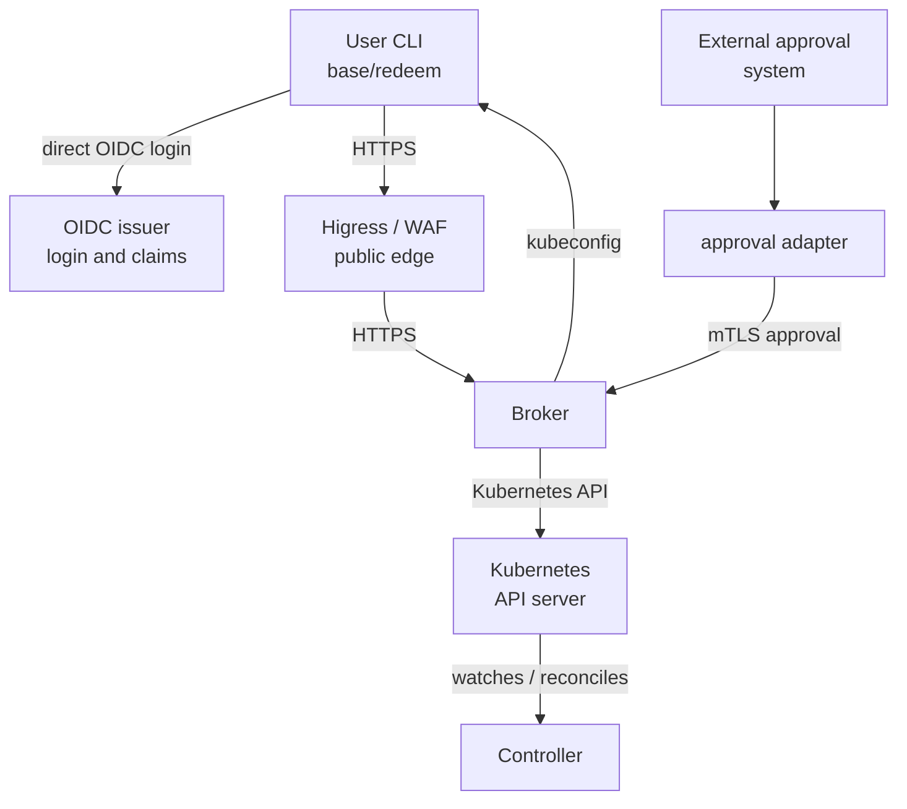
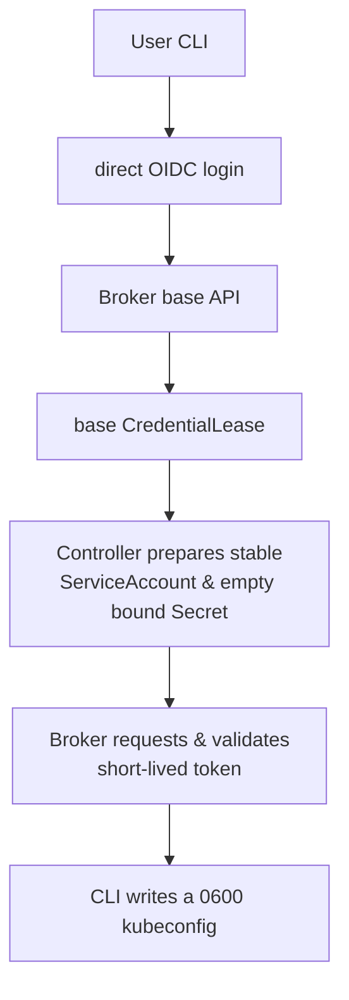
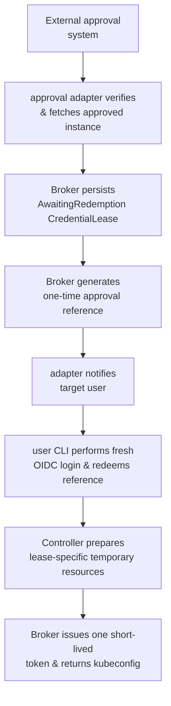

# Internal User Credentials Overview

This is the short introduction to the InternalUser credential system. Read it
before the detailed architecture or design documents. It explains the main
components and user journeys without describing every Kubernetes permission or
failure case.

Detailed documents:

- [Implementation architecture](internal-user-credentials-architecture.md)
- [Design decisions](internal-user-credentials-design.md)
- [Acceptance tests](internal-user-credentials-acceptance.md)
- [User CLI guide](internal-user-credentials-cli.md)
- [Administrator CLI guide](internal-user-admin-cli.md)
- [Approval adapter guide](internal-user-approval-adapter.md)

The Chinese introduction is
[available here](internal-user-credentials-overview.zh-CN.md).

## What problem does it solve?

Internal personnel sometimes need to use Kubernetes, but a permanent shared
administrator kubeconfig is too broad and difficult to revoke safely. This
system gives each person an individual identity and creates short-lived
credentials only when needed.

The system supports two kinds of access:

- **Base access:** a normal, limited credential for routine operations.
- **Elevated access:** a short-lived, more powerful credential that requires an
  approved external workflow.

The credential is a Kubernetes ServiceAccount token delivered inside a
kubeconfig. It is a bearer credential: anyone who obtains the file can use it
until it expires or is revoked. The system therefore uses short lifetimes,
separate identities, one-time issuance, and narrow permissions.

## The five important ideas

| Concept | Meaning |
| --- | --- |
| `InternalUser` | The registered identity of one real internal person |
| `CredentialLease` | The durable record for one credential issuance or approved elevation |
| Broker | The API boundary that authenticates users, enforces policy, and issues tokens |
| Controller | The Kubernetes controller that prepares and removes ServiceAccounts, bindings, and bound Secrets |
| Profile | A platform-owned permission set such as `base-readonly.v1` |

Users do not create or edit `CredentialLease` objects directly. They call the
Broker API. The Broker is the application boundary, while Kubernetes RBAC is
the platform boundary.

## Simple architecture

The CLI accesses the OIDC issuer directly for login. Higress/WAF protects the
Broker route and supplies the normalized client IP. The approval adapter reads
the authoritative external approval and submits it to the Broker; it does not
write Kubernetes resources itself.

## Who does what?

### Internal personnel

The person uses `internal-user-cli`:

1. The CLI opens an OIDC login using Authorization Code + PKCE.
2. The Broker verifies the resulting identity.
3. The Broker creates and processes a lease.
4. The CLI writes the returned kubeconfig to a selected local file with mode
   `0600`.

The person never needs Kubernetes permissions to create a lease. The CLI also
does not choose another target identity or submit arbitrary RBAC rules.

### Administrator

An administrator uses `internal-user-admin` with an administrator kubeconfig
to create, suspend, resume, or delete an `InternalUser`. The administrator
workflow is the source of truth for which personnel are enabled; version one
does not synchronize an external personnel directory automatically.

The administrator CLI also has the controlled manual approval capability. It
submits an already-approved record to the Broker over dedicated mTLS when the
external approval adapter is unavailable or a break-glass procedure is
required.

### Credential Broker

The Broker is the decision and issuance point. It:

- validates OIDC issuer, audience, signature, and identity claims;
- applies profile and TTL limits;
- persists `CredentialLease` records;
- checks that an elevated reference belongs to the authenticated target;
- asks Kubernetes for a short-lived ServiceAccount token;
- returns one kubeconfig and never exposes Kubernetes Secret data.

The Broker cannot create `InternalUser` objects or arbitrary RBAC bindings.

### InternalUser Controller

The Controller turns lease state into Kubernetes resources. It prepares the
ServiceAccount, permission binding, and an empty bound Secret, then removes
them during revocation, expiration, or deletion.

It does not call TokenRequest and does not read token data. Its sensitive
resource cache is limited to `internal-user-system`.

### Approval adapter

The approval adapter receives an approved event, fetches the full approval from the
external approval system, validates the configured fields, and calls the Broker's internal mTLS
endpoint. The Broker creates the approval reference and persists the lease.
The adapter then sends only that reference to the target through the approved
notification channel.

The adapter is intentionally stateless. If the external approval system retries an event, the same
approval ID lets the Broker return the existing result instead of creating a
second lease.

## Normal base access

The base flow is:

Base access uses the user's stable ServiceAccount and the fixed
`base-readonly.v1` profile. It does not require external approval, but it remains
limited by the profile and the maximum TTL.

## Approved elevated access

The elevated flow is different: the user does not call an elevated request API.

The reference is not a replacement for OIDC login. It is valid only for the
target identity recorded in the lease and only until the approval expires.
The elevated permission is attached to a temporary ServiceAccount, never to
the user's stable base account.

## Where state lives

| Resource or location | Purpose |
| --- | --- |
| `InternalUser` | Cluster-scoped identity and base-access lifecycle |
| `CredentialLease` in `internal-credential-broker` | Approval, issuance, expiration, and cleanup state |
| `internal-user-system` | Stable/temporary ServiceAccounts and empty bound Secrets |
| Broker API | User-facing operations and authorization boundary |
| OIDC issuer | Human authentication and group claims |
| External approval system | External human approval state |

`CredentialLease` contains metadata and object references only. It never stores
a token, kubeconfig, private key, or Secret value. Ordinary users and
administrators use the Broker rather than writing this resource through the
Kubernetes API.

## Main security boundaries

- **OIDC identifies the person.** An IP address or approval reference is not an
  identity credential.
- **Higress/WAF and Broker both check source IP.** Higress derives the real
  address and writes a trusted header; the Broker verifies the proxy peer and
  the allowed address again.
- **Elevated access is temporary.** It uses a lease-specific ServiceAccount and
  binding and has a shorter maximum lifetime.
- **Tokens are not stored in Kubernetes Secrets.** The bound Secret is empty;
  it only binds the TokenRequest to a resource lifecycle.
- **Issuance is one-time.** The Broker marks the lease consumed before the
  irreversible TokenRequest. A lost response cannot be reissued from the
  original lease.
- **Controller RBAC is guarded.** An independent admission webhook restricts
  the Controller's ClusterRoleBinding mutations to platform-generated shapes.

## What is not included yet?

This version does not include automatic personnel-directory synchronization or
a portal. The default acceptance run also treats real Higress proxy-chain
verification and centralized audit/information-disclosure testing as separate
release gates. See the acceptance status and TODO documents before treating
the implementation as production-approved.

## Read next

Start with the [implementation architecture](internal-user-credentials-architecture.md)
for the complete component, API, RBAC, network, and recovery design. Use the
[CLI guide](internal-user-credentials-cli.md) for user commands, the
[administrator guide](internal-user-admin-cli.md) for identity administration,
and the [approval adapter guide](internal-user-approval-adapter.md) for the external approval system
and notification deployment.
