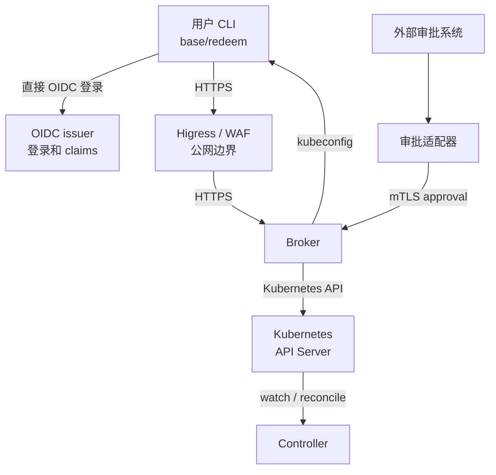
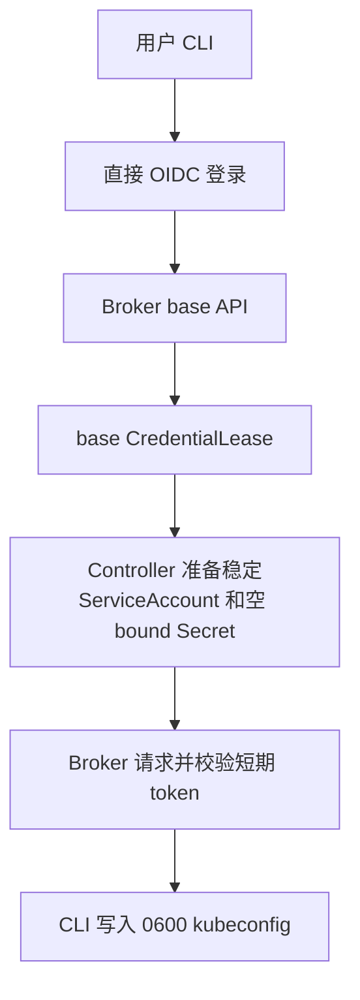
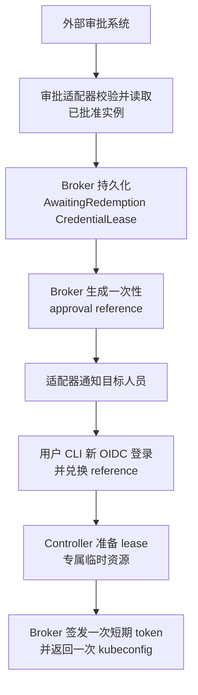

# Internal User 凭据系统概览

这是一份面向第一次阅读 InternalUser 凭据系统人员的简版介绍。建议先阅读
本文，再阅读完整架构文档或设计文档。本文只解释主要组件和用户流程，不展开
每一项 Kubernetes 权限和故障场景。

详细文档：

- [完整实现架构](internal-user-credentials-architecture.zh-CN.md)
- [设计决策](internal-user-credentials-design.zh-CN.md)
- [验收测试](internal-user-credentials-acceptance.zh-CN.md)
- [用户 CLI 说明](internal-user-credentials-cli.zh-CN.md)
- [管理员 CLI 说明](internal-user-admin-cli.zh-CN.md)
- [审批适配器说明](internal-user-approval-adapter.zh-CN.md)

英文版概览见
[internal-user-credentials-overview.md](internal-user-credentials-overview.md)。

## 它解决什么问题？

内部人员有时需要使用 Kubernetes，但长期存在、多人共享的管理员 kubeconfig
权限过大，也很难安全撤销。本系统为每个人建立独立身份，只在需要时签发短期
凭据。

系统提供两种访问：

- **Base 访问：** 日常操作使用的有限权限凭据；
- **Elevated 访问：** 需要外部审批、生命周期更短的高权限凭据。

凭据是一个 Kubernetes ServiceAccount token，封装在 kubeconfig 中返回。它是
bearer credential：获得文件的人可以在它过期或被撤销前使用它。因此系统使用
短 TTL、独立身份、一次性签发和有限权限。

## 五个重要概念

| 概念 | 含义 |
| --- | --- |
| `InternalUser` | 一个真实内部人员的已注册身份 |
| `CredentialLease` | 一次凭据签发或高权限审批的持久化记录 |
| Broker | 认证用户、执行策略并签发 token 的 API 边界 |
| Controller | 准备和删除 ServiceAccount、binding、bound Secret 的 Kubernetes Controller |
| Profile | 平台维护的权限集合，例如 `base-readonly.v1` |

用户不会直接创建或修改 `CredentialLease`。用户调用 Broker API；Broker 是应用
边界，Kubernetes RBAC 是平台边界。

## 简化架构

CLI 直接访问 OIDC issuer 完成登录。Higress/WAF 保护 Broker 路由并传递规范化
客户端 IP。审批适配器读取权威的外部审批系统，并通过 Broker 提交；它自身不写
Kubernetes 资源。

## 谁负责什么？

### 内部人员

人员使用 `internal-user-cli`：

1. CLI 使用 Authorization Code + PKCE 打开 OIDC 登录；
2. Broker 验证登录后的身份；
3. Broker 创建并处理 lease；
4. CLI 将返回的 kubeconfig 写入用户选择的本地文件，并设置 `0600` 权限。

人员不需要 Kubernetes 权限来创建 lease。CLI 也不能选择其他 target 或提交
任意 RBAC 规则。

### 管理员

管理员使用带管理员 kubeconfig 的 `internal-user-admin` 创建、暂停、恢复或
删除 `InternalUser`。管理员流程是人员是否启用的事实来源；v1 不会自动同步
外部人员目录。

管理员 CLI 也提供受控的手动审批能力。当外部审批适配器不可用，或需要执行
破窗流程时，它通过专用 mTLS 向 Broker 提交已经批准的记录。

### Credential Broker

Broker 是决策和签发中心，负责：

- 校验 OIDC issuer、audience、签名和身份 claims；
- 执行 profile 和 TTL 限制；
- 持久化 `CredentialLease`；
- 确认 elevated reference 属于当前登录的目标人员；
- 向 Kubernetes 请求短期 ServiceAccount token；
- 返回一次 kubeconfig，且不读取 Kubernetes Secret 数据。

Broker 不能创建 `InternalUser`，也不能写任意 RBAC binding。

### InternalUser Controller

Controller 将 lease 状态转换为 Kubernetes 资源。它准备 ServiceAccount、权限
binding 和空的 bound Secret，并在撤销、过期或删除时清理这些资源。

它不调用 TokenRequest，也不读取 token 数据；它对敏感资源的 cache 被限制在
`internal-user-system`。

### 审批适配器

审批适配器接收已批准事件，从外部审批系统读取完整审批实例，校验配置字段，并通过
专用 mTLS endpoint 调用 Broker。Broker 创建 approval reference 并持久化
lease，适配器再通过受保护的通知渠道只发送 reference 给目标人员。

适配器是无状态的。如果外部审批系统重复投递事件，同一个 approval ID 会让 Broker 返回
原来的结果，而不是创建第二个 lease。

## 普通 Base 访问

Base 流程如下：

Base 使用用户的稳定 ServiceAccount 和固定的 `base-readonly.v1` profile。不需要
外部审批系统，但仍受 profile 权限和最大 TTL 限制。

## 已批准的 Elevated 访问

Elevated 流程不同：用户不会调用 elevated request API。

reference 不是 OIDC 登录的替代品。它只对 lease 中记录的目标身份有效，并且
只在审批过期时间之前有效。Elevated 权限绑定到临时 ServiceAccount，绝不会
绑定到用户稳定的 base 账号。

## 状态保存在哪里？

| 资源或位置 | 作用 |
| --- | --- |
| `InternalUser` | 集群范围的身份和 base 访问生命周期 |
| `internal-credential-broker` 中的 `CredentialLease` | 审批、签发、过期和清理状态 |
| `internal-user-system` | 稳定/临时 ServiceAccount 和空 bound Secret |
| Broker API | 用户侧操作和授权边界 |
| OIDC issuer | 人员认证和 group claims |
| 外部审批系统 | 外部人工审批状态 | |

`CredentialLease` 只包含元数据和对象引用，永远不保存 token、kubeconfig、私钥
或 Secret value。普通用户和管理员通过 Broker 操作，不通过 Kubernetes API 直接
写这个资源。

## 主要安全边界

- **OIDC 用于识别人员。** IP 地址或 approval reference 都不是身份凭据；
- **Higress/WAF 和 Broker 都校验源 IP。** Higress 推导真实地址并写入可信
  header，Broker 再检查代理 peer 和允许的地址；
- **Elevated 是临时权限。** 它使用 lease 专属 ServiceAccount 和 binding，
  最大生命周期也更短；
- **Token 不存储在 Kubernetes Secret 中。** bound Secret 为空，只用于将
  TokenRequest 绑定到资源生命周期；
- **签发是一次性的。** Broker 在不可逆 TokenRequest 前标记 lease consumed，
  响应丢失后不能从原 lease 重新签发；
- **Controller 的 RBAC 受到保护。** 独立 admission webhook 将 Controller 的
  ClusterRoleBinding mutation 限制为平台生成的结构。

## 当前不包含什么？

本版本不包含自动人员目录同步或 portal。默认验收也将真实 Higress 代理链校验
以及集中审计/信息泄露测试作为单独的 release gate。将实现视为生产批准前，应
先查看验收状态和 TODO 文档。

## 下一步阅读

阅读[完整实现架构](internal-user-credentials-architecture.zh-CN.md)了解组件、
API、RBAC、网络和恢复设计。用户命令查看[用户 CLI 说明](internal-user-credentials-cli.zh-CN.md)，
身份管理查看[管理员 CLI 说明](internal-user-admin-cli.zh-CN.md)，审批和通知部署查看
[审批适配器说明](internal-user-approval-adapter.zh-CN.md)。
